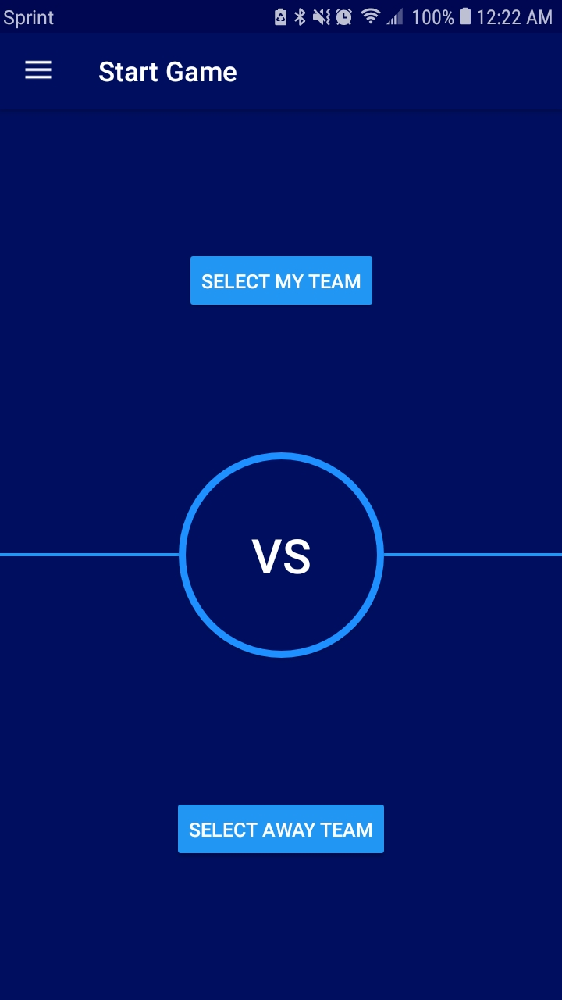
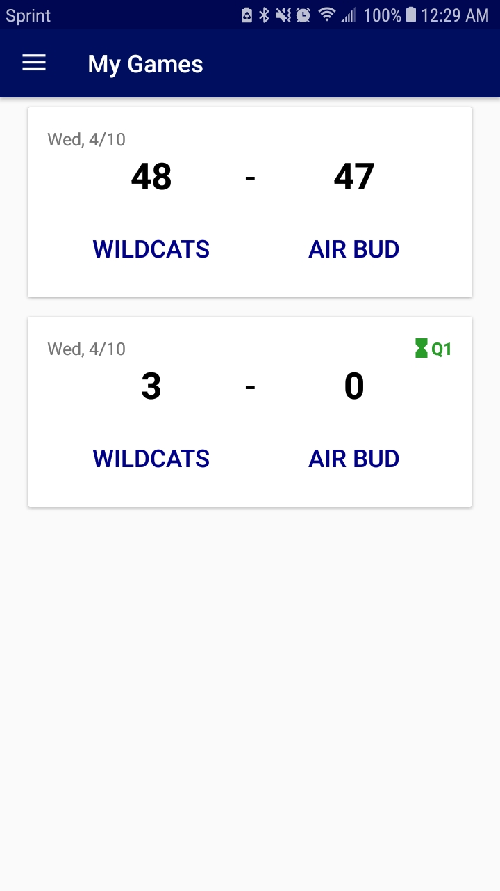
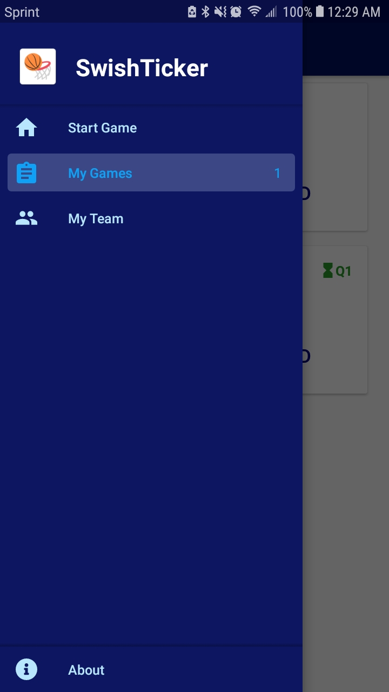
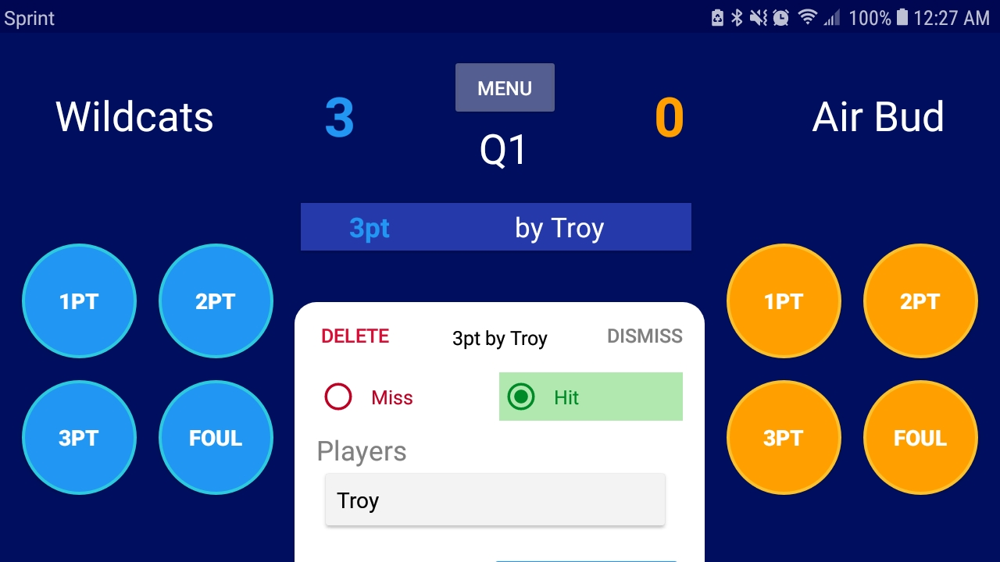
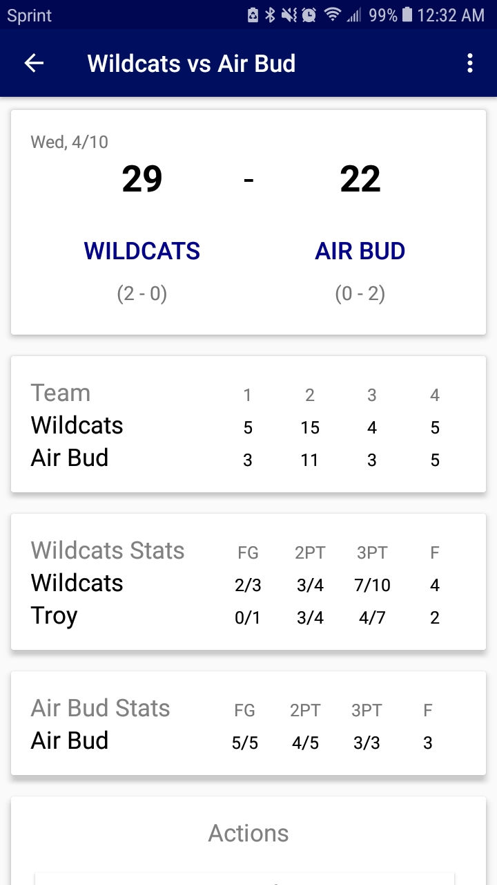
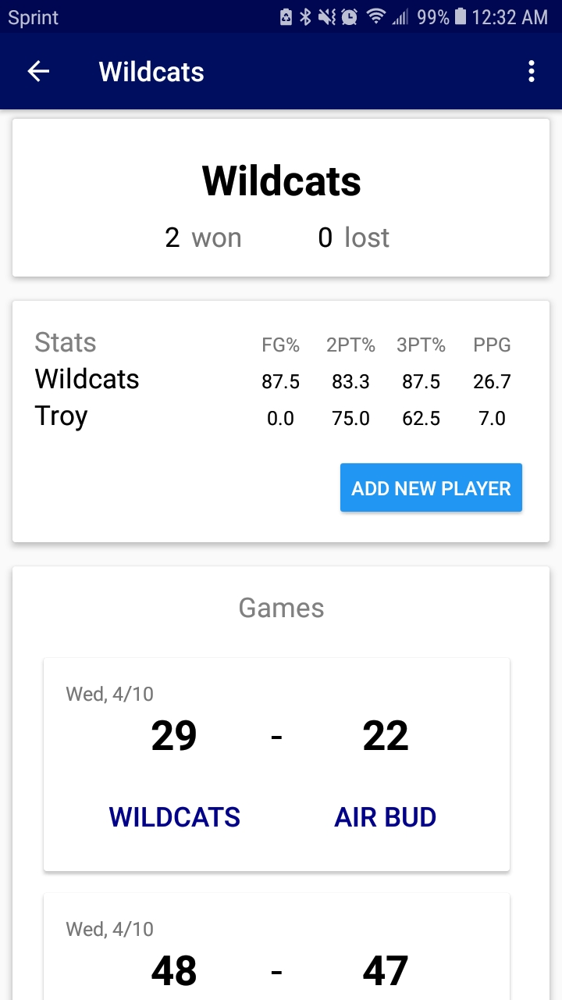
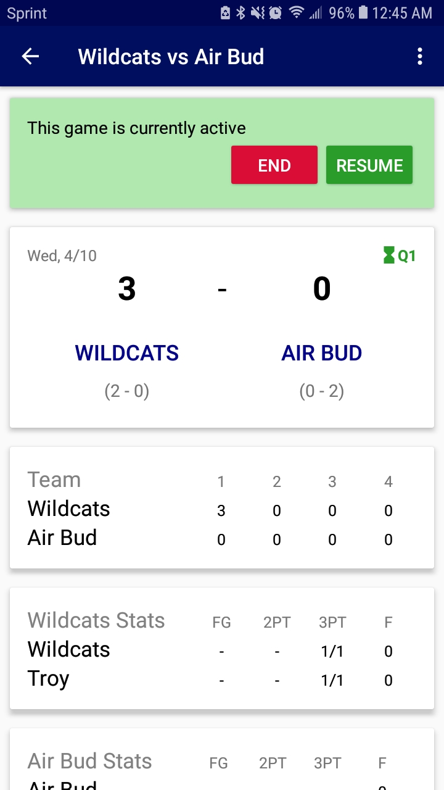

# SwishTicker   

Track your local basketball team's statistics!

## Development

**master** is under active development and should be considered *mostly* stable.

All *releases* of the app will be tagged as *vX.Y.Z*

## Screenshots

          
